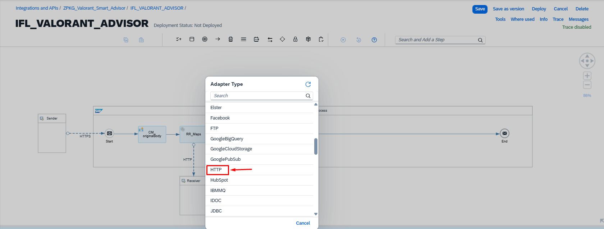
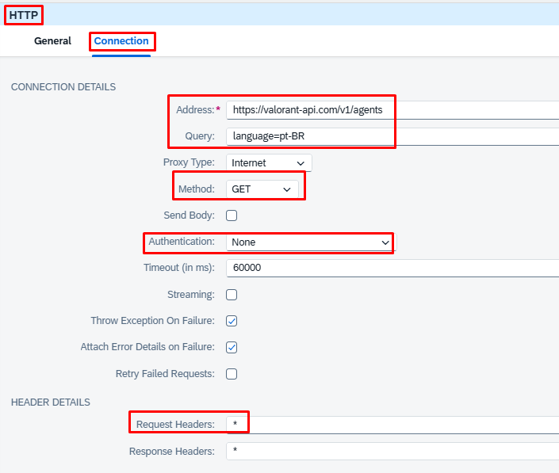

### 🔹 17. Adicionando o HTTP


### 🔹 18. Adicionando o HTTP



### 🔹 19. Agents API →

| Parâmetro     | Valor                              | 
| ------------- | ---------------------------------- |
|Address        | https://valorant-api.com/v1/agents |
| Query         | language=pt-BR                     | 
| Method        | GET                                |
|Authentication | None                               |


Content Modifier – getAgents:
| Name   | Source Type | Source Value | Data Type        |
| ------ | ----------- | ------------ | ---------------- |
| agents | Expression  | ${body}      | java.lang.String | 

### 🔫 Weapons API →

| Parâmetro     | Valor                               | 
| ------------- | ----------------------------------- |
| Address       | https://valorant-api.com/v1/weapons | 
| Query         | language=pt-BR                      |
| Method        | GET                                 | 


Content Modifier – getWeapons:
| Name   | Source Type | Source Value | Data Type        |
| ------ | ----------- | ------------ | ---------------- |
| weapons| Expression  | ${body}      | java.lang.String | 


<br><br><br><br><br><br><br><br><br><br><br><br><br><br>
<br><br><br><br><br><br><br><br><br><br><br><br><br><br>
<br><br><br><br><br><br><br><br><br><br><br><br><br><br>
<br><br><br><br><br><br><br><br><br><br><br><br><br><br>
<br><br><br><br><br><br><br><br><br><br><br><br><br><br>


🔹 6. Groovy Script – Regras de Negócio

Nome: GS_Valorant

📦 Código fonte:
Download do Groovy Script - GS_Valorant.groovy

🔹 7. Preparação para IA – Headers e Prompt
Content Modifier – CM_setValues_IA:

→

Header
Source Type
Source Value
Authorization
Constant
Bearer sk-or-v1-xxxxxxxxxxxxxxxxxxxxxxxxxxxxxxxx
Content-Type
Constant
application/json
⚠️ Atenção: Substitua a chave de exemplo pela sua chave real do OpenRouter.
Groovy Script – GS_PreparePrompt:

→

📦 Código fonte:
Download do Groovy Script - GS_PreparePrompt.groovy
🔹 8. Request-Reply – Chamada à IA (OpenRouter)

→

Parâmetro
Valor
Nome
RR_IA
Address
https://openrouter.ai/api/v1/chat/completions
Method
POST
Authentication
None
Request Headers
* (herda do Content Modifier anterior)
🔹 9. Groovy Script – Parsing da Resposta da IA

Nome: GS_ParseAI

📦 Código fonte:
Download do Groovy Script - GS_ParseAI.groovy

🔹 10. Configuração Final do iFlow

🔐 Configuração OpenRouter
🔑 Gerenciamento de Chaves de API
URL: https://openrouter.ai/workspaces/default/keys

⚙️ Modelo Utilizado

Parâmetro
Valor
Model
nvidia/nemotron-3-super-120b-a12b:free
Temperature
0.3 (respostas mais determinísticas)
Output Format
JSON estruturado
📡 Testando com Postman
🎯 Payload – Estilo Agressivo
json
12345

🛡️ Payload – Estilo Defensivo
json
12345

🤝 Payload – Estilo Suporte
json
12345

🧠 Payload – Estilo Estratégico
json
12345

🔐 Segurança & Boas Práticas
⚠️ Importante: Este repositório é para fins educacionais e de demonstração.
🔒 Recomendações para Produção
Área
Situação Atual
Sugestão para Produção
🔑 API Keys
Hardcoded no Content Modifier
Usar SAP Credential Store ou BTP Destination Service
🔄 Resiliência
Sem fallback na chamada à IA
Adicionar Exception Subprocess com retry ou resposta estática
📦 Validação
Validação básica no Groovy
Incluir JSON Schema Validator antes do processamento
📊 Monitoramento
Logs via message.log
Integrar com SAP Cloud Integration Monitor + custom metrics
⚡ Performance
Chamadas sequenciais às APIs
Avaliar Multicast paralelo para maps/agents/weapons
♻️ Cache
Sem cache de dados estáticos
Usar Data Store do CPI para cache de 15-30min
🚫 Dados Sensíveis
Nunca commitar chaves de API reais no repositório
Utilizar variáveis de ambiente ou serviços seguros de credenciais
Rotacionar chaves periodicamente
📦 Downloads
🗂️ Pacote Completo do iFlow
📥 Download do iFlow – CPI_ZPKG_Valorant-Smart-Advisor-IA-CPI-
💡 Como importar no SAP CPI:
Acesse o SAP Integration Suite
Navegue até Monitor → Artifacts
Clique em Import e selecione o arquivo .zip
Configure as destinations/credenciais conforme necessário
Ative o iFlow e teste via Postman
📄 Scripts Groovy Individuais
Script
Função
Link
GS_Valorant.groovy
Regras de negócio, scoring e estratégia
Baixar
GS_PreparePrompt.groovy
Engenharia de prompt para IA
Baixar
GS_ParseAI.groovy
Parsing e formatação da resposta da IA
Baixar
🤝 Contribuindo
Contribuições são bem-vindas! Sinta-se à vontade para:
🍴 Fazer fork do projeto
🌿 Criar uma branch para sua feature (git checkout -b feature/AmazingFeature)
💾 Commitar suas alterações (git commit -m 'Add: AmazingFeature')
📤 Enviar para o repositório (git push origin feature/AmazingFeature)
🔓 Abrir um Pull Request
🐛 Encontrou um bug?
Abra uma Issue descrevendo o problema
Inclua passos para reproduzir e, se possível, logs do CPI
Sugira uma solução ou melhoria
📄 Licença
Este projeto está sob a licença MIT. Veja o arquivo LICENSE para mais detalhes.
<p align="center">
<strong>Desenvolvido com 💙 para a comunidade SAP e gamers</strong><br>
<sub>Feito por <a href="https://github.com/souzajean">@souzajean</a> • SAP BTP • Valorant Smart Advisor</sub>
</p>

<p align="center">
<a href="#-valorant-smart-advisor--ia--sap-cpi">⬆️ Voltar ao topo</a>
</p>
```
